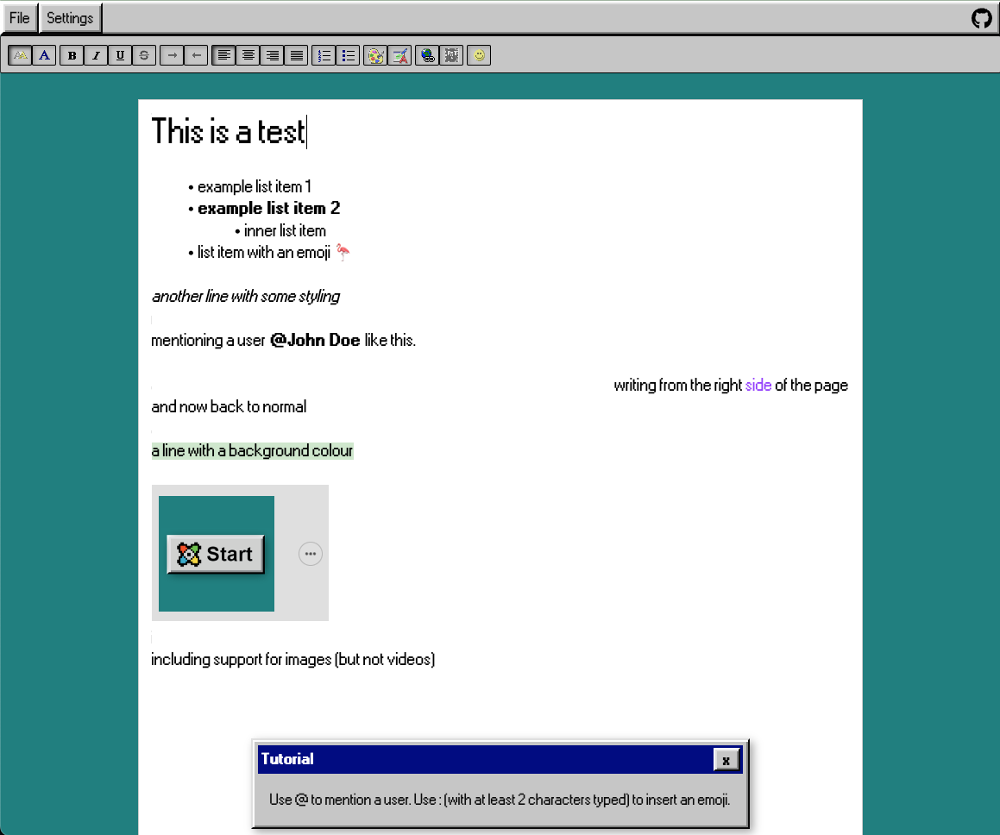

# Letter 95 Document Editor

Document editing web app written in TypeScript using the React and React95 libraries.



## Getting Started

To get started with this project, follow these steps:

- Clone the repository to your local machine:

  ```bash
  git clone https://github.com/barrymun/letter-95.git
  ```

- Navigate to the project directory:
  ```bash
  cd letter-95
  ```

- Install the required dependencies:
  ```bash
  yarn install
  ```

- Run the project with Docker:
  ```bash
  yarn docker-dev-up
  ```

- Alternatively, you can run the project without Docker:
  ```bash
  yarn dev
  ```

## Usage

Start typing! You can add emojis using the `:` character and you can mention users (from an array of sample users) with the `@` character. You can download anything you've written as a PDF, and you can also change the theme.

## Contributing

If you'd like to contribute to this project, feel free to fork the repository and submit a pull request with your changes. Make sure to follow the coding standards and conventions used in the project.

## License

This Chess TypeScript project is licensed under the MIT License. See the [LICENSE](LICENSE) file for details.

## TODO

- [ ] Install `jest` testing framework
- [ ] Emulate pages of a document (similar to Microsoft Word)
- [ ] Support different fonts within the editor
